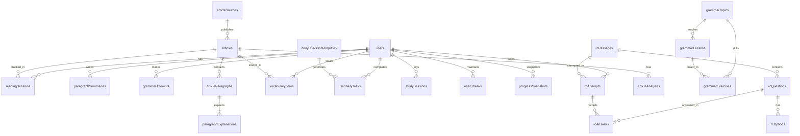

# DATABASE_SCHEMA.md — AstraRead

> Last updated: 2026-06-09  
> Schema file: `src/db/schema.ts` (518 lines, 22 tables)

---

## Entity Relationship Overview

---

## Enums

| Enum | Values | Usage |
|------|--------|-------|
| `article_status` | `draft`, `published`, `archived` | Article publication state |
| `content_source_type` | `rss`, `scrape`, `manual` | How the source feeds content |
| `explanation_source` | `manual`, `generated_once` | Whether explanation was human-written or AI-generated |
| `difficulty_level` | `easy`, `medium`, `hard` | Grammar exercises, RC passages |
| `rc_exam_type` | `CAT`, `XAT`, `SNAP`, `NMAT`, `CUSTOM` | Which exam the RC passage is from |
| `rc_question_tag` | `inference`, `tone`, `main_idea`, `detail`, `assumption`, `vocabulary` | RC question category |

---

## Current Tables (22)

### 1. `users`

Stores all registered users. Maps to Clerk auth via `auth_provider_user_id`.

| Column | Type | Notes |
|--------|------|-------|
| `id` | UUID (PK) | Auto-generated |
| `auth_provider_user_id` | varchar(191) | Unique, maps to Clerk userId |
| `display_name` | varchar(120) | Nullable |
| `email` | varchar(255) | Nullable |
| `created_at` | timestamp(tz) | Auto |
| `updated_at` | timestamp(tz) | Auto |

**Planned additions (Phase 2-3):** `subscription_tier`, `custom_goal_label`, `custom_goal_date`, `last_login_at`

---

### 2. `article_sources`

Content sources from which articles are imported (Aeon, Guardian, Hindu).

| Column | Type | Notes |
|--------|------|-------|
| `id` | UUID (PK) | Auto-generated |
| `name` | varchar(120) | Display name |
| `slug` | varchar(120) | Unique identifier |
| `homepage_url` | text | Source website |
| `feed_url` | text | RSS feed URL (nullable) |
| `source_type` | enum | `rss`, `scrape`, or `manual` |
| `is_active` | boolean | Default true |
| `last_fetched_at` | timestamp(tz) | Last RSS fetch time |
| `created_at` | timestamp(tz) | Auto |

**Seeded with:** Aeon, The Guardian Long Reads, The Hindu Editorials

---

### 3. `articles`

Individual reading essays.

| Column | Type | Notes |
|--------|------|-------|
| `id` | UUID (PK) | Auto-generated |
| `source_id` | UUID (FK → article_sources) | Which source published this |
| `external_id` | varchar(255) | Original article ID from source |
| `url` | text | Original article URL (unique) |
| `slug` | varchar(255) | URL-safe slug (unique) |
| `title` | text | Article title |
| `subtitle` | text | Optional subtitle |
| `author` | varchar(160) | Author name |
| `category` | varchar(120) | Philosophy, Science, etc. |
| `image_url` | text | Cover image URL |
| `published_at` | timestamp(tz) | Original publication date |
| `fetched_at` | timestamp(tz) | When imported into AstraRead |
| `status` | enum | `draft`, `published`, `archived` |
| `word_count` | integer | Total word count |
| `estimated_read_minutes` | integer | Estimated reading time |
| `difficulty_score` | integer | 0-100 difficulty rating |
| `grade_level` | varchar(40) | Reading grade level |
| `full_text` | text | Complete article text |
| `metadata` | jsonb | Extensible metadata (includes inlineQuestions) |

**Indexes:** `url` (unique), `(source_id, status)`, `published_at`

---

### 4. `article_paragraphs`

Individual paragraphs extracted from articles.

| Column | Type | Notes |
|--------|------|-------|
| `id` | UUID (PK) | |
| `article_id` | UUID (FK → articles, cascade) | |
| `position` | integer | 0-indexed paragraph position |
| `text` | text | Paragraph content |
| `connector_words` | jsonb (string[]) | Highlighted connector/transition words |
| `created_at` | timestamp(tz) | Auto |

**Unique constraint:** `(article_id, position)`

---

### 5. `paragraph_explanations`

Prewritten explanations for each paragraph (1:1 with articleParagraphs).

| Column | Type | Notes |
|--------|------|-------|
| `id` | UUID (PK) | |
| `paragraph_id` | UUID (FK → article_paragraphs, unique, cascade) | One explanation per paragraph |
| `simplified_meaning` | text | Plain-language paraphrase |
| `paragraph_purpose` | text | Why this paragraph exists in the argument |
| `key_idea` | text | Central idea of the paragraph |
| `source` | enum | `manual` or `generated_once` |
| `created_at` / `updated_at` | timestamp(tz) | |

---

### 6. `article_analyses`

Whole-article analysis (1:1 with articles, articleId is PK).

| Column | Type | Notes |
|--------|------|-------|
| `article_id` | UUID (PK, FK → articles, cascade) | One analysis per article |
| `passage_summary` | text | Overall passage summary |
| `tone` | varchar(120) | Tone of the passage |
| `difficult_vocabulary` | jsonb (Array<{term, meaning}>) | Vocabulary with definitions |
| `new_phrases` | jsonb (string[]) | Notable phrases |
| `central_ideas` | jsonb (Array<{paragraph, idea}>) | Per-paragraph central ideas |
| `reading_difficulty_score` | integer | 0-100 |
| `reading_grade_level` | varchar(40) | |
| `source` | enum | `manual` or `generated_once` |
| `created_at` / `updated_at` | timestamp(tz) | |

---

### 7-9. Grammar Tables

#### `grammar_topics`
Top-level grammar categories (e.g., "Articles", "Modifiers").

| Column | Type | Notes |
|--------|------|-------|
| `id` | UUID (PK) | |
| `slug` | varchar(120) | Unique |
| `title` | varchar(160) | |
| `description` | text | |
| `sort_order` | integer | < 10 = Foundations, >= 10 = Reading Flow |
| `is_published` | boolean | |
| `created_at` | timestamp(tz) | |

**Planned:** Add `section` column (`"foundations"` | `"reading_patterns"`) to replace sortOrder-based filtering

#### `grammar_lessons`
Explanatory content within a topic.

| Column | Type | Notes |
|--------|------|-------|
| `id` | UUID (PK) | |
| `topic_id` | UUID (FK → grammar_topics, cascade) | |
| `title` | varchar(180) | |
| `content` | text | Lesson explanation (supports basic markdown) |
| `examples` | jsonb (string[]) | Example sentences |
| `sort_order` | integer | |

#### `grammar_exercises`
Interactive drills attached to a topic.

| Column | Type | Notes |
|--------|------|-------|
| `id` | UUID (PK) | |
| `topic_id` | UUID (FK → grammar_topics, cascade) | |
| `lesson_id` | UUID (FK → grammar_lessons, nullable) | |
| `difficulty` | enum | `easy`, `medium`, `hard` |
| `prompt` | text | Question with blanks |
| `answer` | text | Correct answer |
| `explanation` | text | Why this answer is correct |
| `choices` | jsonb (string[]) | Multiple choice options |
| `sort_order` | integer | |

---

### 10. `grammar_attempts`
User answers to grammar exercises.

| Column | Type | Notes |
|--------|------|-------|
| `id` | UUID (PK) | |
| `user_id` | UUID (FK → users, cascade) | |
| `exercise_id` | UUID (FK → grammar_exercises, cascade) | |
| `answer` | text | User's selected answer |
| `is_correct` | boolean | |
| `attempted_at` | timestamp(tz) | |

---

### 11-15. RC Tables

#### `rc_passages`
Complete RC passages (from CAT PYQs or custom).

| Column | Type | Notes |
|--------|------|-------|
| `id` | UUID (PK) | |
| `exam_type` | enum | `CAT`, `XAT`, `SNAP`, `NMAT`, `CUSTOM` |
| `year` | integer | Exam year (0 for custom) |
| `title` | text | Passage title |
| `passage` | text | Full passage text |
| `source_label` | varchar(160) | E.g., "Slot 1", "Morning" |
| `difficulty` | enum | `easy`, `medium`, `hard` |
| `estimated_minutes` | integer | |
| `created_at` | timestamp(tz) | |

**Planned:** Add `slot` column for year→slot grouping

#### `rc_questions`
Questions attached to RC passages.

| Column | Type | Notes |
|--------|------|-------|
| `id` | UUID (PK) | |
| `passage_id` | UUID (FK → rc_passages, cascade) | |
| `tag` | enum | `inference`, `tone`, `main_idea`, `detail`, `assumption`, `vocabulary` |
| `prompt` | text | Question text |
| `correct_option_key` | varchar(4) | A/B/C/D |
| `explanation` | text | Overall explanation |
| `tone_clues` | jsonb (string[]) | Phrases indicating author's tone |
| `trap_words` | jsonb (string[]) | Deceptive words in wrong options |
| `inference_logic` | text | Logical reasoning required |
| `sort_order` | integer | |

#### `rc_options`
Options for each RC question.

| Column | Type | Notes |
|--------|------|-------|
| `id` | UUID (PK) | |
| `question_id` | UUID (FK → rc_questions, cascade) | |
| `option_key` | varchar(4) | A/B/C/D |
| `text` | text | Option text |
| `explanation` | text | Why correct/incorrect |
| `is_correct` | boolean | |

#### `rc_attempts` + `rc_answers`
Track user attempts and per-question answers.

---

### 16-18. User Activity Tables

#### `vocabulary_items`
Words saved by users during reading.

| Column | Type | Notes |
|--------|------|-------|
| `id` | UUID (PK) | |
| `user_id` | UUID (FK → users, cascade) | |
| `article_id` | UUID (FK → articles, nullable) | Source article |
| `term` | varchar(160) | |
| `meaning` | text | |
| `context_sentence` | text | Sentence from the article |
| `review_count` | integer | Spaced repetition counter |
| `last_reviewed_at` | timestamp(tz) | |
| `created_at` | timestamp(tz) | |

#### `daily_checklist_templates` + `user_daily_tasks`
System-defined daily tasks and user completions.

#### `user_streaks`
Per-type streak tracking (reading, grammar, RC, vocabulary).

#### `progress_snapshots`
Daily snapshots of user progress metrics.

---

### 19-22. Tables Planned for Removal (Phase 3)

| Table | Reason |
|-------|--------|
| `reading_sessions` | Replaced by simpler `user_article_reads` |
| `paragraph_summaries` | User-written summaries removed from product |
| `study_sessions` | Generic — replaced by per-module tracking |

### Tables Planned for Addition (Phase 3)

| Table | Purpose |
|-------|---------|
| `user_article_reads` | Track which articles a user has read (userId, articleId, readAt, timeSpentSeconds) |
| `user_bookmarks` | Bookmarked articles and RC passages |
